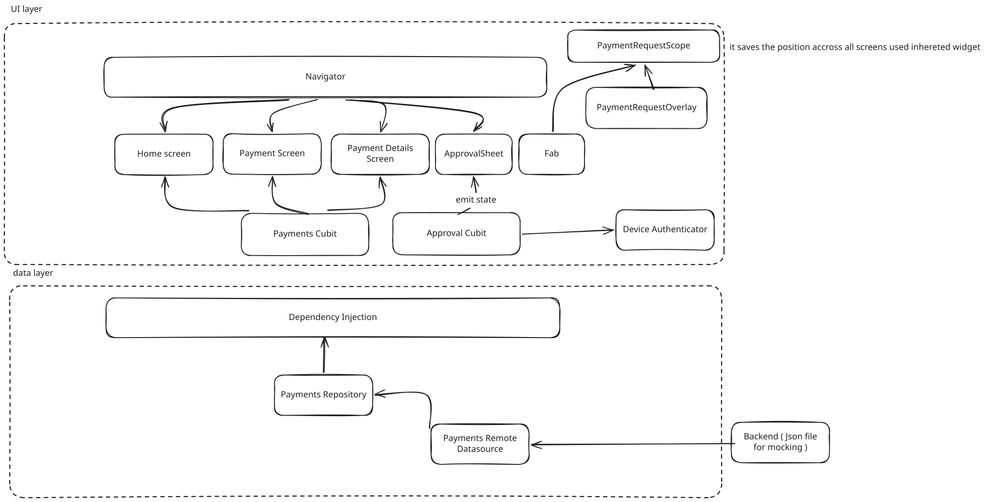

# Payments App

A Flutter payment review app with a monthly summary, payment history, and device authentication before revealing request details.

## Architecture

The app uses a feature-based structure with presentation and data layers. Home and Payments share payment state, while each approval sheet has its own authentication state.

| Component | Responsibility |
| --- | --- |
| `ProjectTask` | Configures the app, provides the shared payment Cubit, and installs the request overlay. |
| `AppRouter` / Navigator | Handles tabs, payment detail routes, and modal navigation. |
| `HomeScreen` | Displays the monthly approved total, payment count, and recent payments. |
| `PaymentsScreen` | Lists approved and rejected payments, newest first. |
| `PaymentDetailsScreen` | Displays a selected payment's amount, recipient, status, date, reference, and note. |
| `BaseScaffold` / FAB | Renders the draggable request button and forwards taps and drag events. |
| `PaymentRequestOverlay` | Creates requests, opens the approval sheet, submits decisions, and saves/restores the FAB position. |
| `PaymentRequestScope` | Shares the FAB position, busy state, and callbacks across screens. |
| `ApprovalSheet` | Masks sensitive details, offers authentication, and returns the user's approval or rejection. |
| `ApprovalCubit` | Manages authentication progress, failure, and revealed details for one sheet. |
| `DeviceAuthenticator` | Defines the authentication interface; `LocalDeviceAuthenticator` implements it using `local_auth`. |
| `PaymentsCubit` / `PaymentsState` | Loads and updates shared payment state, with filtered history and monthly summary calculations. |
| `PaymentsRepository` | Applies decision rules, including allowing approval or rejection only for pending requests. |
| `PaymentsRemoteDataSource` / `AssetPaymentDataSource` | Defines data operations and implements them using JSON fixtures and session memory. |
| Mock JSON assets | `payments.json` seeds payment history; `incoming_payment_requests.json` supplies new request templates. |
| Dependency injection (`sl`) | Registers services and wires the Cubit, repository, data source, authentication, and storage dependencies. |
| `KeyValueStorage` | Provides storage access backed by SharedPreferences for local preferences such as FAB position and theme. |
| Theme scopes / `AppTheme` | Manage the selected theme and supply shared colors, typography, and component styles. |

Authentication reveals request details; approving the payment is a separate user action. Payment changes stay in memory for the current session and do not modify the JSON assets.

## Design system

The app uses a custom design system inspired by Kanan Yusubov's [Design System from scratch in Flutter](https://medium.com/flutter-community/design-system-from-scratch-in-flutter-bc2aebb8bb02). Shared colors, typography, spacing, and component themes keep the UI consistent across screens and light/dark modes. Theme extensions expose styles through helpers such as `context.colors` and `context.typography`.

Widgets follow an Atomic Design-inspired structure:

| Level | Purpose | Examples |
| --- | --- | --- |
| Atoms | Small reusable visual elements. | `AppCard`, `SectionLabel`, `MoneyText`, `StatusBadge` |
| Molecules | Combine elements into a focused component. | `PaymentTile`, `StatBlock` |
| Organisms | Compose larger UI sections. | `MonthlySummaryCard`, `RecentPaymentsSection` |
| Screens | Assemble sections and connect user actions to state and navigation. | `HomeScreen`, `PaymentsScreen`, `PaymentDetailsScreen` |

This structure keeps styling reusable and lets screens focus on composition.

## Payment references

Background reading for the payment domain:

- [Payment Service Provider (PSP)](https://en.wikipedia.org/wiki/Payment_service_provider)
- [Payment Card Industry Data Security Standard (PCI DSS)](https://en.wikipedia.org/wiki/Payment_Card_Industry_Data_Security_Standard)
- [Stripe: Payment tokenisation](https://stripe.com/en-es/resources/more/payment-tokenization-101)

The assignment uses mock payments. It does not integrate a PSP or implement payment tokenisation, and it makes no PCI DSS compliance claim. UI masking hides displayed values; it is not tokenisation.
